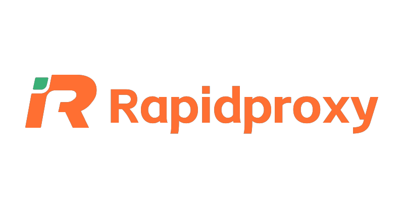
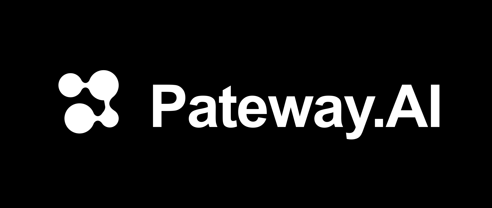
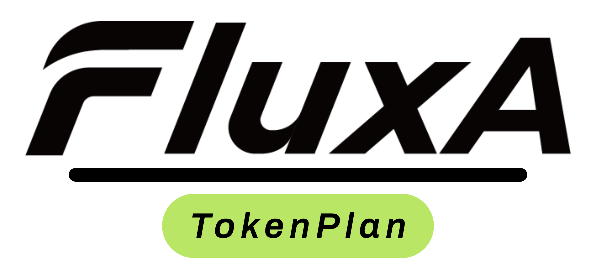

# CLI Proxy API

[English](README.md) | [中文](README_CN.md) | 日本語

デスクトップで CLIProxyAPI を利用したい場合は、[EasyCLIProxyAPI](https://github.com/router-for-me/EasyCLIProxyAPI) デスクトップクライアントをおすすめします。グラフィカルな設定画面、自動更新、システムトレイ連携、CLIProxyAPI サービスのワンクリック起動/停止などの機能を提供します。

CLIProxyAPI は、CLI向けのOpenAI/Gemini/Claude/Codex/Grok互換APIインターフェースを提供するプロキシサーバーです。

ローカル環境や複数のCLIアカウントを通じて、OpenAI（Responses含む）、Gemini（Interactions含む）、またはClaude互換のクライアントやSDKから、以下のプロバイダーにアクセスできます。

<table>
<tbody>
    <tr>
        <th align="center" width="100">プロバイダー</th>
        <th align="center">説明</th>
    </tr>
    <tr>
        <td align="center"></td>
        <td>Kimiシリーズモデル（Kimi K3、Kimi K2.7 Codeなど）。<a href="https://platform.kimi.ai/docs/guide/kimi-k3-quickstart">Kimi K3</a>は、Moonshot AIで最も高性能なモデルであり、世界初のオープンな3兆パラメータ級モデルです。2.8兆のパラメータ、ネイティブな視覚機能、100万トークンのコンテキストウィンドウを備え、長期間にわたるコーディング、知識作業、推論向けに構築されています。CLIProxyAPIはOAuthまたは互換APIインターフェース経由でKimiをサポートします。<a href="https://www.kimi.com/code/?aff=cliproxyapi">Kimi Codeサブスクリプション</a>を試すか、<a href="https://platform.kimi.ai?track_id=track-8a28e4b291d84f62af2fccc3e7a21cb3&aff=cliproxyapi">Kimi Open Platform</a>でAPIキーを取得してください。CLIProxyAPIとオープンソースコミュニティを支援してくださるKimiに感謝します！</td>
    </tr>
    <tr>
        <td align="center"></td>
        <td>OpenAI GPTシリーズモデル（GPT 5.6、GPT 5.5など）。GPT-5.6は、複雑な本番ワークフロー向けに新しい品質と効率の基準を打ち立てます。GPT-5.6は特にトークン効率が高く、レイアウト、視覚的階層、デザイン判断を含むフロントエンドの美的品質も向上しています。</td>
    </tr>
    <tr>
        <td align="center"></td>
        <td>Anthropic Claudeシリーズモデル（Claude Fable、Claude Opus、Claude Sonnetなど）。Claude Fable 5は、Anthropicが広く公開している中で最も高性能なモデルであり、最も要求の厳しい推論と長期間のエージェント作業向けに構築されています。</td>
    </tr>
    <tr>
        <td align="center"></td>
        <td>Google Geminiシリーズモデル（Gemini 3.5 Flash、Gemini 3.1 Proなど）。Gemini 3.5 Flashは、実世界タスク向けに最適化された持続的なフロンティア級の知能を、より高速かつ低コストで提供します。エージェント時代向けに設計されており、サブエージェント展開、多段階ワークフロー、大規模な長期間タスクに優れています。このモデルは、複雑なコーディングサイクルと反復を含む迅速なエージェントループに特に効果的です。</td>
    </tr>
    <tr>
        <td align="center"></td>
        <td>xAI Grokシリーズモデル（Grok 4.5、Grok Composer 2.5 Fastなど）。Grok 4.5は、コーディング、エージェントタスク、知識作業向けに構築されたSpaceXAIのフロンティアモデルです。科学、工学、数学にわたる新しいデータセットを用いて、SpaceXAIのメンフィスにあるデータセンターで訓練されました。</td>
    </tr>
</tbody>
</table>

## スポンサー

PackyCodeのスポンサーシップに感謝します！

PackyCodeは信頼性が高く効率的なAPIリレーサービスプロバイダーで、Claude Code、Codex、Geminiなどのリレーサービスを提供しています。

PackyCodeは当ソフトウェアのユーザーに特別割引を提供しています：<a href="https://www.packyapi.com/register?aff=cliproxyapi">こちらのリンク</a>から登録し、チャージ時にプロモーションコード「cliproxyapi」を入力すると10%割引になります。

---

<table>
<tbody>
<tr>
<td width="180"></td>
<td>AICodeMirrorのスポンサーシップに感謝します！AICodeMirrorはClaude Code / Codex / Gemini向けの公式高安定性リレーサービスを提供しており、エンタープライズグレードの同時接続、迅速な請求書発行、24時間365日の専任技術サポートを備えています。Claude Code / Codex / Geminiの公式チャネルが元の価格の38% / 2% / 9%で利用でき、チャージ時にはさらに割引があります！CLIProxyAPIユーザー向けの特別特典：<a href="https://www.aicodemirror.ai/register?invitecode=TJNAIF">こちらのリンク</a>から登録すると、初回チャージが20%割引になり、エンタープライズのお客様は最大25%割引を受けられます！</td>
</tr>
<tr>
<td width="180"></td>
<td>APIKEY.FUNのスポンサーシップに感謝します！APIKEY.FUNはプロフェッショナルなエンタープライズ向けAIリレーサービスで、企業および個人開発者に安定・高効率・低コストなAIモデルAPI接続サービスを提供しています。Claude、OpenAI、Geminiなどの主要人気モデルに対応し、価格は公式価格の7%から利用できます。本プロジェクトの<a href="https://apikey.fan/register?aff=CLIProxyAPI">専用リンク</a>から登録すると、さらに<b>チャージが永続的に5%割引</b>となる特別優待を受けられます。</td>
</tr>
<tr>
<td width="180"></td>
<td>CyberPay（サイバー決済）は2021年に設立されました。AI業界の事業者向けに、安定・高効率・安全な決済精算ソリューションを提供することに取り組んでいます。私たちと連携することで、WebサイトやプラットフォームでのAlipay/WeChat決済の受け取り課題を解決できます。GPT、Gemini、Claude、Codexアカウントやリレープラットフォームなど、各種事業提携にも対応し、事業者の決済回収に関する課題を解決します。<a href="https://t.me/CyberWlD/218">お問い合わせ</a>ください。</td>
</tr>
<tr>
<td width="180"></td>
<td>FennoAI は、安定性と効率性に優れた API リレーサービスプロバイダーで、現在は主に Codex リレーサービスを提供しています。OpenAI および Anthropic プロトコルに対応し、Codex、Claude Code、OpenCode などの主要なコーディングツールへ柔軟に接続できます。1日あたり数千億 Token 規模のエンタープライズ利用を安定して支え、国内および海外法人向けの企業間決済と請求書発行にも対応しています。FennoAI は CLIProxyAPI ユーザー限定の特典を提供しています。<a href="https://api.fenno.ai/s/Cvf0">専用リンク</a>からサブスクリプションを購入すると、わずか 1.99 ドルで 50 ドル相当の Coding Plan クレジットを獲得できます。さらに紹介報酬にも対応しており、招待した友人が購入すると最大 20% のコミッションを獲得できます。招待が多いほど、報酬も高くなります。</td>
</tr>
<tr>
<td width="180"></td>
<td>本プロジェクトは <a href="https://s.qiniu.com/7zUJri">七牛雲AI</a> にご支援いただいています！七牛雲AI は七牛雲（02567.HK）傘下のエンタープライズ向け大規模モデル MaaS プラットフォームです。世界の主要モデル150以上をワンストップで呼び出せ、世界の主要モデルプロバイダーのプロトコルに対応し、テキスト、画像、音声、動画、ファイル処理などのフルモーダル処理能力をカバーしています。169万を超える企業および開発者ユーザーにサービスを提供しています。専用特典：企業ユーザーは <b>1,200万 Token</b> を無料で受け取れ、友人招待で最大100億 Tokenを獲得できます。</td>
</tr>
<tr>
<td width="180"></td>
<td>Cubenceのスポンサーシップに感謝します！Cubenceは信頼性が高く効率的なAPIリレーサービスプロバイダーで、Claude Code、Codex、Geminiなどのリレーサービスを提供しています。Cubenceは当ソフトウェアのユーザーに特別割引を提供しています：<a href="https://cubence.com/signup?code=CLIPROXYAPI&source=cpa">こちらのリンク</a>から登録し、チャージ時にプロモーションコード「CLIPROXYAPI」を入力すると10%割引になります。</td>
</tr>
<tr>
<td width="180"></td>
<td>APIMartによる本プロジェクトへのご支援に感謝します！APIMartは、AI画像・動画生成に特化した低価格APIプラットフォームです。GPT-Image-2は1枚あたりわずか&#36;0.006で、1ドルで160枚以上の画像を生成できます。画像と動画の両方を1つの非同期APIで扱えます。タスクを送信してIDを取得し、ポーリングまたはコールバックで結果を受け取れます。数万枚規模の画像をタイムアウトなしでバッチ生成でき、コードを変更せずにモデルを切り替えられます。従量課金制で月額料金は不要です。<a href="https://go.apimart.ai/gh-cliproxyapi">こちらの登録リンク</a>からすぐに始められます。</td>
</tr>
<tr>
<td width="180"></td>
<td>中国本土と世界各地の双方からのアクセス体験に配慮しながら、WebサイトとAPIを保護・高速化します。さらにクライアントSDKを通じて、高速化とセキュリティの機能をネイティブ／モバイルアプリにも拡張します — <b>セルフホスト型プライベートCDN｜サブスクリプション型DDoS防御CDN｜自律的に制御でき、柔軟に組み合わせられるCDNネットワーク。</b></td>
</tr>
<tr>
<td width="180"></td>
<td>Swiftproxyは、世界220以上の国と地域をカバーする9,000万以上のクリーンな住宅IPを提供し、HTTP(S)/SOCKS5、IPローテーション、Sticky Session、詳細な地域指定に対応しています。AI APIツールや自動化ワークフローが異なる地域からオンラインサービスへ安定してアクセスできるよう支援し、APIリクエスト、Webアクセス、データ収集、地域別テストなどに最適です。住宅プロキシは&#36;0.7/GBから利用でき、無料テストにも対応しています。割引コードPROXY90の使用で10%割引になります。<a href="https://www.swiftproxy.net/?code=PR67S9A95">今すぐSwiftproxyを試す</a></td>
</tr>
<tr>
<td width="180"></td>
<td>本プロジェクトは Aiberm のスポンサー支援を受けています。Aiberm は、開発者向けに統合された割引 AI API を提供しています。1つのエンドポイントから Claude、GPT、Grok、DeepSeek、GLM、Kimi、MiniMax を利用でき、Claude は85〜90%割引、GPT は90%割引、Grok は80%割引です。GPT Image 2 と Nano Banana による画像生成にも対応しています。<a href="https://aiberm.com?ref=cpa">Aiberm にアクセス</a>。</td>
</tr>
<tr>
<td width="180"></td>
<td><a href="https://www.rapidproxy.io/?code=KHM9B6E6M">RapidProxy</a> は、自動化や複数アカウント運用向けに設計された高性能プロキシプロバイダーで、クリーンな住宅プロキシとネイティブ静的 ISP IP を提供しています。世界中に9,000万以上の住宅 IP を保有し、スマートローテーション、安定したセッション、高い同時接続性能に対応しています。Webスクレイピング、ブラウザ自動化、SNSアカウント管理、EC運用、アカウントの一括登録などに最適です。住宅プロキシはわずか &#36;0.55/GB から利用でき、トラフィックに有効期限はありません。コード RAPID10 の使用で10%割引になり、<a href="https://www.rapidproxy.io/?code=KHM9B6E6M">今すぐ無料トライアルを開始できます。</a></td>
</tr>
<tr>
<td width="180"></td>
<td>PatewayAI は、経験豊富な AI 開発者向けの API リレーサービスプロバイダーで、Claude および Codex シリーズのモデルを完全にサポートしています。すべてのモデルは高品質な公式チャネルから提供され、希釈や偽装は一切なく、課金明細も透明で確認可能です。エコノミーモードは公式価格のわずか5%から利用できます。<a href="https://pateway.ai/?ch=jjvdb">こちらのリンク</a>から登録するとトライアルクレジットを受け取れるほか、不定期のキャンペーンで無料クレジットを獲得できます。また、エンタープライズ級の同時接続、専用管理ダッシュボード、正式な契約書と請求書に対応し、双方に最大150米ドルが付与される紹介特典も提供しています。</td>
</tr>
<tr>
<td width="180"></td>
<td>FluxA &amp; Baidu AI Cloud による本プロジェクトへのご支援に感謝します！FluxA と百度智能雲が共同で提供する AgenticPlan は、AI Agent がモデル、API、ツールを自律的に購入・管理・利用できるようにします。百度千帆 TokenPlan が含まれ、通常価格の60%という低価格から DeepSeek V4、GLM 5.2、Kimi などのフラッグシップモデルを利用できます。さらに FluxA AgentMarket API の呼び出しクレジットが付与され、検索、データスクレイピング、ソーシャルメディア、金融、暗号資産、画像生成、動画など、1,000以上の有料 API を利用できます。  ユーザーの承認のもと、AI Agent は公式 Visa カード決済を利用してリソースを自律的に調達し、API Key の管理、使用量の監視、更新計画の策定も行えます。これにより Agent は「自律的にタスクを完了する」段階から、真に「予算を自律的に計画し、タスクを完了する」段階へ進化できます。<a href="https://agentmarket.fluxapay.xyz/marketplace/tokenplans">AgenticPlan の詳細を見る</a>。</td>
</tr>
</tbody>
</table>

## 概要

- CLIモデル向けのOpenAI/Gemini/Claude/Grok互換APIエンドポイント
- OAuthログインによるOpenAI Codexサポート（GPTモデル）
- OAuthログインによるClaude Codeサポート
- OAuthログインによるGrok Buildサポート
- ストリーミング、非ストリーミング、および対応環境でのWebSocketレスポンス
- 関数呼び出し/ツールのサポート
- マルチモーダル入力サポート（テキストと画像）
- ラウンドロビン負荷分散による複数アカウント対応（Gemini、OpenAI、Claude、Grok）
- シンプルなCLI認証フロー（Gemini、OpenAI、Claude、Grok）
- Generative Language APIキーのサポート
- AI Studioビルドのマルチアカウント負荷分散
- Claude Codeのマルチアカウント負荷分散
- OpenAI Codexのマルチアカウント負荷分散
- Grok Buildのマルチアカウント負荷分散
- 設定によるOpenAI互換アップストリームプロバイダー（例：OpenRouter）
- プロキシ埋め込み用の再利用可能なGo SDK（`docs/sdk-usage.md`を参照）

## はじめに

CLIProxyAPIガイド：[https://help.router-for.me/](https://help.router-for.me/)

## 管理API

[MANAGEMENT_API.md](https://help.router-for.me/management/api)を参照

## 使用量統計

v6.10.0以降、CLIProxyAPIおよび [CPAMC](https://github.com/router-for-me/Cli-Proxy-API-Management-Center) プロジェクトには使用量統計機能がプリセットされなくなりました。使用量統計が必要な場合は、次のプロジェクトをご利用ください：

### [CPA Usage Keeper](https://github.com/Willxup/cpa-usage-keeper)

CLIProxyAPI向けの独立した使用量永続化・可視化サービス。CLIProxyAPIデータを定期同期してSQLiteに保存し、集計APIと、使用量や各種統計を確認できる組み込みダッシュボードを提供します。

### [CPA-Manager-Plus](https://github.com/seakee/CPA-Manager-Plus)

リクエスト単位の監視とコスト推定を備えたCLIProxyAPI向けのフル管理センターです。CPA-Managerは、収集したリクエストをアカウント、モデル、チャネル、レイテンシ、ステータス、Token使用量ごとに追跡し、編集可能なモデル価格とLiteLLM価格のワンクリック同期でコストを推定します。SQLiteでイベントを永続化し、Codexアカウントプール向けに一括検査、クォータ判定、異常アカウント検出、クリーンアップ提案、ワンクリック実行を提供し、日常的なマルチアカウント運用に適しています。

## SDKドキュメント

- 使い方：[docs/sdk-usage.md](docs/sdk-usage.md)
- 上級（エグゼキューターとトランスレーター）：[docs/sdk-advanced.md](docs/sdk-advanced.md)
- アクセス：[docs/sdk-access.md](docs/sdk-access.md)
- ウォッチャー：[docs/sdk-watcher.md](docs/sdk-watcher.md)
- カスタムプロバイダーの例：`examples/custom-provider`

## コントリビューション

コントリビューションを歓迎します！お気軽にPull Requestを送ってください。

1. リポジトリをフォーク
2. フィーチャーブランチを作成（`git checkout -b feature/amazing-feature`）
3. 変更をコミット（`git commit -m 'Add some amazing feature'`）
4. ブランチにプッシュ（`git push origin feature/amazing-feature`）
5. Pull Requestを作成

## 関連プロジェクト

CLIProxyAPIをベースにした以下のプロジェクトがあります：

### [vibeproxy](https://github.com/automazeio/vibeproxy)

macOSネイティブのメニューバーアプリで、Claude CodeとChatGPTのサブスクリプションをAIコーディングツールで使用可能 - APIキー不要

### [Subtitle Translator](https://github.com/VjayC/SRT-Subtitle-Translator-Validator)

CLIProxyAPI経由で既存のLLMサブスクリプション（Gemini、ChatGPT、Claude, etc.）を使用してSRT字幕を翻訳および検証する、クロスプラットフォームのデスクトップおよびWebアプリ - APIキー不要。

### [CCS (Claude Code Switch)](https://github.com/kaitranntt/ccs)

CLIProxyAPI OAuthを使用して複数のClaudeアカウントや代替モデル（Gemini、Codex、Antigravity）を即座に切り替えるCLIラッパー - APIキー不要

### [Quotio](https://github.com/nguyenphutrong/quotio)

Claude、Gemini、OpenAI、Antigravityのサブスクリプションを統合し、リアルタイムのクォータ追跡とスマート自動フェイルオーバーを備えたmacOSネイティブのメニューバーアプリ。Claude Code、OpenCode、Droidなどのコーディングツール向け - APIキー不要

### [ProxyPilot](https://github.com/Finesssee/ProxyPilot)

TUI、システムトレイ、マルチプロバイダーOAuthを備えたWindows向けCLIProxyAPIフォーク - AIコーディングツール用、APIキー不要

### [Claude Proxy VSCode](https://github.com/uzhao/claude-proxy-vscode)

Claude Codeモデルを素早く切り替えるVSCode拡張機能。バックエンドとしてCLIProxyAPIを統合し、バックグラウンドでの自動ライフサイクル管理を搭載

### [ZeroLimit](https://github.com/0xtbug/zero-limit)

CLIProxyAPIを使用してAIコーディングアシスタントのクォータを監視するTauri + React製のWindowsデスクトップアプリ。Gemini、Claude、OpenAI Codex、Antigravityアカウントの使用量をリアルタイムダッシュボード、システムトレイ統合、ワンクリックプロキシコントロールで追跡 - APIキー不要

### [CPA-XXX Panel](https://github.com/ferretgeek/CPA-X)

CLIProxyAPI向けの軽量Web管理パネル。ヘルスチェック、リソース監視、リアルタイムログ、自動更新、リクエスト統計、料金表示機能を搭載。ワンクリックインストールとsystemdサービスに対応

### [CLIProxyAPI Tray](https://github.com/kitephp/CLIProxyAPI_Tray)

PowerShellスクリプトで実装されたWindowsトレイアプリケーション。サードパーティライブラリに依存せず、ショートカットの自動作成、サイレント実行、パスワード管理、チャネル切り替え（Main / Plus）、自動ダウンロードおよび自動更新に対応

### [霖君](https://github.com/wangdabaoqq/LinJun)

霖君はAIプログラミングアシスタントを管理するクロスプラットフォームデスクトップアプリケーションで、macOS、Windows、Linuxシステムに対応。Claude Code、Gemini、OpenAI Codexなどのコーディングツールを統合管理し、ローカルプロキシによるマルチアカウントクォータ追跡とワンクリック設定が可能

### [CLIProxyAPI Dashboard](https://github.com/itsmylife44/cliproxyapi-dashboard)

Next.js、React、PostgreSQLで構築されたCLIProxyAPI用のモダンなWebベース管理ダッシュボード。リアルタイムログストリーミング、構造化された設定編集、APIキー管理、Claude/Gemini/Codex向けOAuthプロバイダー統合、使用量分析、コンテナ管理、コンパニオンプラグインによるOpenCodeとの設定同期機能を搭載 - 手動でのYAML編集は不要

### [All API Hub](https://github.com/qixing-jk/all-api-hub)

New API互換リレーサイトアカウントをワンストップで管理するブラウザ拡張機能。残高と使用量のダッシュボード、自動チェックイン、一般的なアプリへのワンクリックキーエクスポート、ページ内API可用性テスト、チャネル/モデルの同期とリダイレクト機能を搭載。Management APIを通じてCLIProxyAPIと統合し、ワンクリックでプロバイダーのインポートと設定同期が可能

### [Shadow AI](https://github.com/HEUDavid/shadow-ai)

Shadow AIは制限された環境向けに特別に設計されたAIアシスタントツールです。ウィンドウや痕跡のないステルス動作モードを提供し、LAN（ローカルエリアネットワーク）を介したクロスデバイスAI質疑応答のインタラクションと制御を可能にします。本質的には「画面/音声キャプチャ + AI推論 + 低摩擦デリバリー」の自動化コラボレーションレイヤーであり、制御されたデバイスや制限された環境でアプリケーション横断的にAIアシスタントを没入的に使用できるようユーザーを支援します。

### [ProxyPal](https://github.com/buddingnewinsights/proxypal)

CLIProxyAPIをネイティブGUIでラップしたクロスプラットフォームデスクトップアプリ（macOS、Windows、Linux）。Claude、ChatGPT、Gemini、GitHub Copilot、カスタムOpenAI互換エンドポイントに対応し、使用状況分析、リクエスト監視、人気コーディングツールの自動設定機能を搭載 - APIキー不要

### [CLIProxyAPI Quota Inspector](https://github.com/AllenReder/CLIProxyAPI-Quota-Inspector)

CLIProxyAPI向けのすぐに使えるクロスプラットフォームのクォータ確認ツール。アカウントごとの codex 5h/7d クォータ表示、プラン別ソート、ステータス色分け、複数アカウントの集計分析に対応。

### [CLIProxy Pool Watch](https://github.com/murasame612/CLIProxyPoolWidget)

CLIProxyAPIプール内のChatGPT/Codexアカウントクォータを監視するmacOSネイティブSwiftUIアプリ。Management APIを通じて、アカウントの可用性、Plus基準の容量、5時間/週次クォータバー、プラン重み、復元予測を表示します。

### [Panopticon](https://github.com/eltmon/panopticon-cli)

AIコーディングアシスタント向けのマルチエージェントオーケストレーションツール。CLIProxyAPIをローカルsidecarとして実行することで、エージェントがChatGPTサブスクリプション経由でGPTモデルを利用できるようにし、Claude CodeをAnthropic互換エンドポイントへ向けるため、OpenAI APIキーは不要です。

### [Tunnel Agent](https://github.com/Villoh/tunnel-agent)

CLIProxyAPIとPerplexity WebUI Scraperをひとつのインターフェースで管理するWindowsデスクトップUI。QuotioとVibeProxyにインスパイアされ、OAuthプロバイダー（Claude、Gemini、Codex、Kimi、Antigravity）、カスタムAPIキー、Perplexityセッションアカウントを接続し、任意のコーディングエージェントをローカルエンドポイントに向けることができます。

### [Quotio Desktop](https://github.com/xiaocoss/quotio-desktop)

Quotio のクロスプラットフォーム（Tauri）移植版（Windows / macOS / Linux 対応）。CLIProxyAPI 経由で複数の AI アカウント（Codex、Claude Code、GitHub Copilot、Gemini、Antigravity、Kiro、Cursor、Trae、GLM）のプールを管理し、アカウントごとの 5 時間 / 週間クォータバー、Codex のリセットクレジットとワンクリックリセット、スマートスケジューリング、使用統計、Codex マルチインスタンスに対応。API キー不要。

### [Universal Chat Provider](https://github.com/maxdewald/vscode-universal-chat-provider)

Claude、ChatGPT/Codex、Antigravity、Grok、Kimi のサブスクリプションを GitHub Copilot Chat のネイティブ言語モデルとして利用できる VS Code 拡張機能です。Git のコミットメッセージ、チャットタイトル、要約の生成にも使えます。CLIProxyAPI を完全管理されたバックグラウンドライフサイクル（ダウンロード、検証、監視）で実行し、すべてのウィンドウで共有するため、セットアップは不要です。API キーは不要で、OAuth だけで利用できます。

### [CPA-Tray-Powershell](https://github.com/ztzpro/CPA-Tray-Powershell.git)

PowerShellベースのWindows向けCLIProxyAPIシステムトレイランチャー。コンソールウィンドウを表示せずにバックグラウンドで実行し、管理ページを開き、管理ウィンドウを閉じた後もバックエンドを維持してトレイからページを再表示できます。起動時のCLIProxyAPI更新確認、SHA-256検証と失敗時のロールバック、ワンクリックでのCLIProxyAPI再起動と更新、PID検証に基づくプロセス管理、安全なサービス停止にも対応しています。

### [Grok Search MCP](https://github.com/MapleMapleCat/Grok_Search_Mcp)

HTTP専用のModel Context Protocol（MCP）サーバーです。CLIProxyAPIのデプロイメントを利用して、MCPクライアントにGrokを活用したリアルタイムWeb検索、X/Twitter検索、モデル検出を提供します。MCPトランスポート、クライアントAPIキー管理、クォータ、使用量追跡、Web管理パネルも備えています。

### [AIUsage](https://github.com/sylearn/AIUsage)

macOSネイティブのSwiftUI製AIサブスクリプションダッシュボード兼コーディングプロキシ管理アプリ。公式CLIProxyAPIリリースのダウンロード、検証、起動・監視、更新、ロールバックをアプリ内で管理し、OAuthアカウントとライブモデルを統合します。1つのゲートウェイをCodex、Claude Code/Science、OpenCode、OpenAI/Anthropic/Geminiクライアントへ接続でき、LANアクセスにも対応します。

### [Claude Dialects](https://github.com/stefandevo/claude-dialects)

ネイティブ同様の操作感を持つ複数のClaude Codeコマンドを実行し、それぞれを異なるモデル（Codex、GLM、Kimi、Gemini、Grok、MiniMax、DeepSeek、Cursor、Copilot、Claude）で動作させます。各コマンドは、独立した設定、履歴、ポート、およびGo SDKで連携した組み込みCLIProxyAPIインスタンスを備えた本物のClaude Codeインターフェースを起動するため、プロキシを別途インストールする必要はありません。macOSのみ対応。詳細は[claude-dialects.cc](https://claude-dialects.cc/)をご覧ください。

### [WebBrain](https://github.com/webbrain-one/webbrain)

CLIProxyAPI のローカル OpenAI 互換エンドポイントをモデルプロバイダーとして利用できるブラウザーエージェントです。EasyCLIProxyAPI を通じて CLIProxyAPI を使用する場合は、WebBrain の独立した[セットアップ、セキュリティ、アカウントリスクのガイド](https://webbrain.one/docs/easy-cli-proxy/)をご覧ください。

### [Infinitus](https://github.com/deathemperor/infinitus)

CLIProxyAPI の Management API 経由で複数の Claude アカウントを管理するネイティブ macOS メニューバーアプリ（claude-swap と 9Router にも対応）。5 時間 / 7 日 / モデル別のクォータゲージ、ポップアップからの切り替え / 保留 / スター、現在のペースから各ウィンドウが尽きる時刻を予測する機能に加え、iPhone からも同じ状態を確認できます。

### [PiCloud](https://github.com/cookerpapa/pi-cloud)

Pi SDK をベースにしたセルフホスト型コーディングエージェント基盤。Web UI、並列サブエージェント、CubeSandbox KVM ワークスペースを備えています。CLIProxyAPI をモデルプロバイダーへのゲートウェイとして利用し、プロバイダーの認証情報をゲストのワークスペースから分離します。

### [cc-status-line](https://github.com/kinka/cc-status-line)

Claude Code のステータスライン。現在の CPA インスタンスに対応する Codex / Grok / Antigravity / Claude のアカウント別クォータ（5h / 7d / 週）とリセットまでの時間を表示します。`ANTHROPIC_BASE_URL` でインスタンスを選び、Management API 経由でクォータを取得します。

> [!NOTE]
> CLIProxyAPIをベースにプロジェクトを開発した場合は、PRを送ってこのリストに追加してください。

## その他の選択肢

以下のプロジェクトはCLIProxyAPIの移植版またはそれに触発されたものです：

### [9Router](https://github.com/decolua/9router)

CLIProxyAPIに触発されたNext.js実装。インストールと使用が簡単で、フォーマット変換（OpenAI/Claude/Gemini/Ollama）、自動フォールバック付きコンボシステム、指数バックオフ付きマルチアカウント管理、Next.js Webダッシュボード、CLIツール（Cursor、Claude Code、Cline、RooCode）のサポートをゼロから構築 - APIキー不要

### [OmniRoute](https://github.com/diegosouzapw/OmniRoute)

コーディングを止めない。無料および低コストのAIモデルへのスマートルーティングと自動フォールバック。

OmniRouteはマルチプロバイダーLLM向けのAIゲートウェイです：スマートルーティング、負荷分散、リトライ、フォールバックを備えたOpenAI互換エンドポイント。ポリシー、レート制限、キャッシュ、可観測性を追加して、信頼性が高くコストを意識した推論を実現します。

### [Codex Switch](https://github.com/9ycrooked/CodexSwitch)

Tauri 2 + Vue 3で構築された、複数のOpenAI Codexデスクトップアカウントを管理するためのツールです。保存済みのChatGPT/Codex認証プロファイルを切り替え、5時間および週次クォータ使用量をリアルタイムで確認し、tokenの状態を検証し、現在のアカウント詳細を表示し、手動コピーなしでauth.jsonファイルをインポートまたは保存できます。

> [!NOTE]
> CLIProxyAPIの移植版またはそれに触発されたプロジェクトを開発した場合は、PRを送ってこのリストに追加してください。

## ライセンス

本プロジェクトはMITライセンスの下でライセンスされています - 詳細は[LICENSE](LICENSE)ファイルを参照してください。
